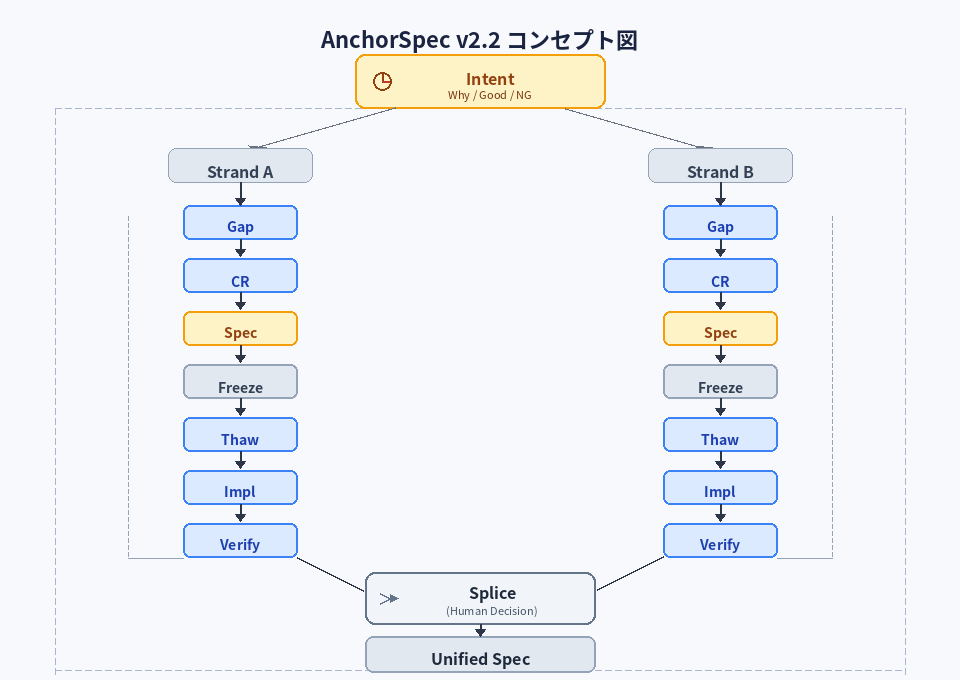
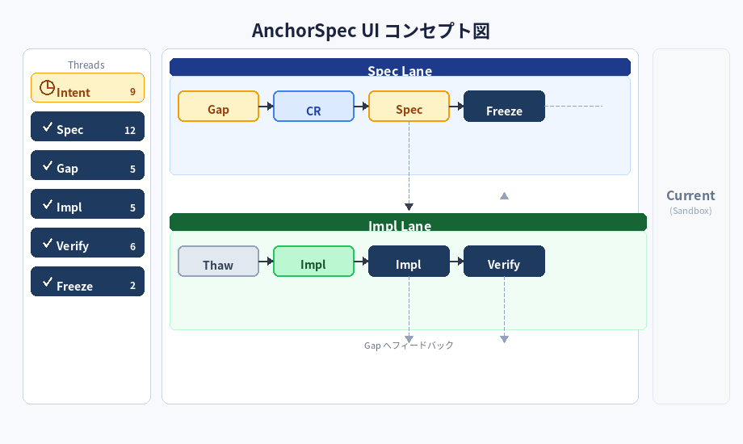

<<<<<<< HEAD
# AnchorSpec v2 — AI-Native Development Protocol

Author: ニア・アノマ  
Co-Author (AI): マリー先生

---

## 🧭 Overview

> AnchorSpecは「思考・仕様・実装」を分離し、再接続する開発プロトコルである。

AnchorSpecはAI協働開発のための構造化プロトコルである。

本バージョンでは、従来の状態遷移モデルに加え、

並行開発を扱うための構造拡張（Strand / Splice）が導入された。

- スレッド分離

- 意図駆動（Intent Driven）

- 差分管理（Gap / CR）

- 検証（Verify）

- 凍結（Freeze）

により、開発の混乱・破綻・属人化を防ぐ。

👉 AI時代における「仕様迷子」を防ぐための開発プロトコル

---

## なぜAnchorSpecか

AIを用いた開発では以下の問題が発生する。

-   コンテキストの崩壊

-   仕様の不整合

-   過去議論の追跡困難

-   思いつきによる仕様の破壊

AnchorSpecはこれらを解決するために

-   スレッド分離

-   変更プロセスの強制

-   履歴の明確化

を提供する。

---

AnchorSpecは

**AIと人間が共同で開発を行うためのスレッド分割型開発手法である。**

開発対象の

**仕様・議論・実装・履歴**

を役割ごとに分離したスレッドで管理する。

すべてのスレッドは

**人間によって作成される。**

---

## 🧑‍💻 Human Responsibility

AnchorSpecにおいて、

**構造（スレッド / Feature / CRの境界）は人間が決定する。**

AIは以下を担う：

- 内容の生成

- 整理の補助

- 検証（Verify）

---

### 原則

- AIは構造を提案できるが、確定は人間が行う

- 構造の決定権は常に人間にある

---

### 理由

構造はIntentと強く結びつくため、  

自動化するとズレが拡大する。

---

## Thread（スレッド）

スレッドとは

**1つのチャット（会話単位）**である。

-   独立した文脈

-   固有の役割

-   個別の履歴

を持つ。

履歴は不変であり、変更は新規発言として追加される。

---

## 基本スレッド

AnchorSpecでは

**1つのProjectに以下の基本スレッドが存在する。**

■ Core Threads
- Intent
- Spec
- Gap

■ Execution Threads
- Impl
- ImplGap

■ State Threads
- FreezeSpec
- FreezeImpl

■ Sandbox
- Current

---

## 🔁 State Lifecycle

AnchorSpecは以下の状態遷移を持つ：

Gap → CR → Spec → Freeze → Thaw → Impl → Verify → Gap

---

## 🧱 Structural Model

AnchorSpecは2軸構造を持つ：

- 縦軸：状態遷移（Lifecycle）

- 横軸：Strand（並行開発ライン）

各Strandは独立した状態遷移を進行し、

Spliceによって統合される。

---

## 状態機械原則

AnchorSpecは状態遷移を持つステートマシンとして解釈される。

各要素は状態ノードであり、

各操作は状態遷移として定義される。

---

## 🧠 Concept Diagram（v2）

### ポイント

- Intentが最上位

- Gapにすべてが収束（入口市場）

- Verifyによるズレ検出

- Currentによる未責任領域の隔離

---

## 🖥 UI Concept

### ポイント

- 左：スレッド管理（Intent / Spec / Gap / Impl / Verify / Freeze）

- 中央：Spec Lane（仕様パイプライン）

- 下：Impl Lane（実装）

- 右：Current（実験サンドボックス）

👉 Gitライクだが「思考」まで扱う

---

## Project

仕様・議論・実装・履歴を含む開発単位。

---

# Feature

F-001 MetaInfo

F-002 CharacterSpec

F-003 ExpressionSpec

---

# 管理コマンド

## index

Feature一覧を表示

## print

現在の状態を表示する。

printはスレッド依存で動作する。

-   Spec → 仕様表示

-   Gap → 未commit CR

-   Impl → 実装状態

必要に応じて他スレッド参照可。

## log

commit履歴を表示

---

# 🧭 Vision（Intent）スレッドテンプレート

## 🧭 Vision / Intent

- Why: なぜこれをやるのか  

- Goal: 達成したい状態  

- Good: 成功の定義  

- NG: やってはいけないこと  

- Scope: 対象 / 非対象  

- Notes: 前提・制約  

---

# 🧩 Editions

## AnchorSpec Core（Full）

- Intent

- Spec

- Gap

- Current

- FreezeSpec

- Impl

- ImplGap

- Verify

- FreezeImpl

---

## AnchorSpec Lite

### 構成

- Spec

- Gap

- Impl

---

### なぜLiteを使うのか

Liteは  

**「最小構成で高速に回すためのAnchorSpec」**である。

---

### 用途

- 個人開発  

- AI実験  

- MVP開発  

---

### 特徴

- Intent / Verify / Freezeを省略

- スピード重視

👉 構造を保ちながら軽量化したモード

---

## AnchorSpec Design

- Intent

- Spec

- Gap

- Current

---

# 🧠 Core Concepts

## Spec

- Source of Truth

- Approvedな変更のみ反映

---

## Gap

すべての変化が流入する場所。

- 未定義

- 矛盾

- アイディア

- フィードバック

👉 AnchorSpecの「入口市場」

---

## CR（Change Request）

CRは単なる変更提案ではない。  

**「仕様変更を安全に通すための中核構造」**である。

👉 Issue + Pull Request のハイブリッド

---

### 構造

- What：何を変更するか  

- Why：なぜ変更するのか  

- Impact：影響範囲  

- Feature：対象機能  

- Discussion：議論ログ  

---

### Status

- Draft：提案段階  

- Reviewed：議論済  

- Approved：反映可能  

⚠️ ApprovedのみSpecへ反映可能

---

### 役割

- Gapを構造化する

- 変更の正当性を担保する

- Specの破壊を防ぐ

👉 「変更の関所」

---

## Current（重要）

UI上の「実験サンドボックス」。

- SpecやImplに影響しない

- 正しさ保証なし

- 仮説・検証用

⚠️ 直接採用は禁止  

👉 必ずGapへ昇格

---

## Verify

Verifyは  

**「構造が破綻していないか」を検査するレイヤー**である。

👉 修正はしない、検出のみ

---

### Verify種類

- Spec Check：Spec内部の矛盾  

- Impl Check：Specと実装の乖離  

- Intent Check：Intentとのズレ  

- Coverage Check：実装網羅性  

---

### 役割

- 仕様崩壊の防止

- 意図逸脱の検出

- 実装暴走の抑制

---

### 運用ルール

- 問題を見つけても直接修正しない

- 必ずGapへフィードバックする

---

### 出力

- 不整合レポート

- Gap提案

👉 Verifyは「修正しない品質保証レイヤー」

---

## Freeze

- Version Lock

- 履歴確定

- Specの状態を不変として固定する

---
## 🆕 Parallel Model（v2.2）

### Strand

並行して進行する開発単位（branch相当）

- 各Gap / CR / Specは特定のStrandに属する

- StrandはFeature単位で作成される

- 各Strandは独立して状態遷移を進行する

---

### Splice

複数のStrandを編み込み、統合する操作（merge相当）

- 並行するSpecの競合を解決する

- 構造の決定は人間が行う（自動化禁止）

- 統合結果として新しいSpecを生成する

- 必要に応じて新たなGapを生成する

---

## Thaw

FreezeされたSpecを再びImpl可能な状態に展開すること。

- Gitにおけるcheckout相当

- Strand / Spliceとは別軸の操作（分岐ではない）

- FreezeSpec に対して行う

- Freezeの解除ではなく、**参照・再起動**

- FreezeSpec自体は変更されない（履歴は不変）

👉 過去バージョンのSpecをベースに新たなImplを開始できる

---

## ImplContext

Specを実装に落とし込むための環境定義。

- Language（例: TypeScript / Python）

- Framework（例: React / FastAPI）

- Runtime（例: Node / Browser）

- Constraints（制約条件）

- Non-Functional Requirements（性能・セキュリティ等）

---

# 🤖 AI運用モデル

AIは以下のスレッドで作業を行う。

## 実装AI（Builder）

- Specに基づいて実装

- Implスレッド担当

## 監査AI（Auditor）

- Verify担当

- Spec / Impl / Intentの整合性を検証

---

# 🔁 Execution Flow

0. Intent  

1. Feature  

2. Gap  

3. CR（Draft → Approved）  

4. Spec  

5. Verify  

6. Freeze  

7. ImplContext  

8. Impl  

9. Feedback（ImplGap / Verify → Gap）

---
# 🔄 Feedback Loop

- Verify → Gap  

- ImplGap → Gap  

- Current → Gap  

👉 すべてGapに収束

---

## ⚙️ Operations

| 操作 | 説明 |

|------|------|

| Gap作成 | 違和感・アイデアの流入 |

| CR昇格 | Gapを変更要求へ変換 |

| CR承認 | Approved状態へ移行 |

| Spec反映 | ApprovedなCRのみ反映 |

| Freeze | Specのバージョン確定 |

| Thaw | Impl用にSpecを解凍 |

| Strand作成 | 並行開発ライン生成 |

| Splice | Strand統合 |

| Verify | 整合性チェック（修正は行わない） |

---

# 拡張スレッド

例：

-   Test

-   Review

-   Ops

---

# Git対応

-   FreezeSpec → tag

-   CR → commit相当（論理的変更単位）

-   Strand → branch

-   Splice → merge

---

# 🧭 When to Use

| 状況 | Edition |

|------|--------|

| アイデア整理 | Design |

| 個人開発 | Lite |

| 本格開発 | Core |

---

# 🚀 Quick Start（AI向け運用手順）

AnchorSpecの基本的な使い方：

1. Intentを定義する

 - 目的・ゴールを明確化

2. Gapにすべての違和感・アイデアを入れる  

 - 未整理でOK

3. CRで整理する  

 - What / Why / Impact を明確化

4. Specに反映する（Approvedのみ）

4.5 必要に応じてStrandを作成し並行開発を行う

4.6 Spliceで統合する

5. Verifyで構造チェック  

 - 修正はしない

6. Freeze（Spec確定）  

7. ImplContextを定義する

8. Implで実装する

9. 問題があればImplGap → Gapへ戻す

---

## 重要ルール

- Specを直接編集しない  

- 変更は必ずCRを通す  

- Verifyは修正しない  

- Currentは採用しない（必ずGapへ）

---

## 一言でいうと

👉 「ズレをGapに集めて、CRで整理し、Specに反映する」

---

# 🧠 Summary

AnchorSpecは

**「思考（Intent）・仕様（Spec）・実装（Impl）を分離し、  

差分（Gap）と検証（Verify）によって安全に進化させる開発プロトコル」**

である。

---

# 🚀 Next

- GitHub公開

- GUIアプリ化

- チーム導入

👉 ここからプロダクトになる

--- 

## ⚠️ Anti-Pattern

### AIに構造を丸投げする

一見効率的に見えるが、  

スレッド構造が意図と乖離し、全体が崩壊する。

---

### Lesson

- 構造は人間が持つべき責任

- AIは補助に徹する

---

AnchorSpecはこの失敗から設計されている。

---

# 原則

Specは常に成立

変更はGap経由のみ

---

# ⚠️ Pending / Known Issues

- Spliceの競合解決プロセス詳細未定義

- Strandのスコープ（Feature単位前提だが拡張余地あり）

=======
# AnchorSpec v2 — AI-Native Development Protocol

Author: ニア・アノマ  
Co-Author (AI): マリー先生

---

## 🧭 Overview

> AnchorSpecは「思考・仕様・実装」を分離し、再接続する開発プロトコルである。

AnchorSpecはAI協働開発のための構造化プロトコルである。

本バージョンでは、従来の状態遷移モデルに加え、

並行開発を扱うための構造拡張（Strand / Splice）が導入された。

- スレッド分離

- 意図駆動（Intent Driven）

- 差分管理（Gap / CR）

- 検証（Verify）

- 凍結（Freeze）

により、開発の混乱・破綻・属人化を防ぐ。

👉 AI時代における「仕様迷子」を防ぐための開発プロトコル

---

## なぜAnchorSpecか

AIを用いた開発では以下の問題が発生する。

-   コンテキストの崩壊

-   仕様の不整合

-   過去議論の追跡困難

-   思いつきによる仕様の破壊

AnchorSpecはこれらを解決するために

-   スレッド分離

-   変更プロセスの強制

-   履歴の明確化

を提供する。

---

AnchorSpecは

**AIと人間が共同で開発を行うためのスレッド分割型開発手法である。**

開発対象の

**仕様・議論・実装・履歴**

を役割ごとに分離したスレッドで管理する。

すべてのスレッドは

**人間によって作成される。**

---

## 🧑‍💻 Human Responsibility

AnchorSpecにおいて、

**構造（スレッド / Feature / CRの境界）は人間が決定する。**

AIは以下を担う：

- 内容の生成

- 整理の補助

- 検証（Verify）

---

### 原則

- AIは構造を提案できるが、確定は人間が行う

- 構造の決定権は常に人間にある

---

### 理由

構造はIntentと強く結びつくため、  

自動化するとズレが拡大する。

---

## Thread（スレッド）

スレッドとは

**1つのチャット（会話単位）**である。

-   独立した文脈

-   固有の役割

-   個別の履歴

を持つ。

履歴は不変であり、変更は新規発言として追加される。

---

## 基本スレッド

AnchorSpecでは

**1つのProjectに以下の基本スレッドが存在する。**

■ Core Threads
- Intent
- Spec
- Gap

■ Execution Threads
- Impl
- ImplGap

■ State Threads
- FreezeSpec
- FreezeImpl

■ Sandbox
- Current

---

## 🔁 State Lifecycle

AnchorSpecは以下の状態遷移を持つ：

Gap → CR → Spec → Freeze → Thaw → Impl → Verify → Gap

---

## 🧱 Structural Model

AnchorSpecは2軸構造を持つ：

- 縦軸：状態遷移（Lifecycle）

- 横軸：Strand（並行開発ライン）

各Strandは独立した状態遷移を進行し、

Spliceによって統合される。

---

## 状態機械原則

AnchorSpecは状態遷移を持つステートマシンとして解釈される。

各要素は状態ノードであり、

各操作は状態遷移として定義される。

---

## 🧠 Concept Diagram（v2）

### ポイント

- Intentが最上位

- Gapにすべてが収束（入口市場）

- Verifyによるズレ検出

- Currentによる未責任領域の隔離

---

## 🖥 UI Concept

### ポイント

- 左：スレッド管理（Intent / Spec / Gap / Impl / Verify / Freeze）

- 中央：Spec Lane（仕様パイプライン）

- 下：Impl Lane（実装）

- 右：Current（実験サンドボックス）

👉 Gitライクだが「思考」まで扱う

---

## Project

仕様・議論・実装・履歴を含む開発単位。

---

# Feature

F-001 MetaInfo

F-002 CharacterSpec

F-003 ExpressionSpec

---

# 管理コマンド

## index

Feature一覧を表示

## print

現在の状態を表示する。

printはスレッド依存で動作する。

-   Spec → 仕様表示

-   Gap → 未commit CR

-   Impl → 実装状態

必要に応じて他スレッド参照可。

## log

commit履歴を表示

---

# 🧭 Vision（Intent）スレッドテンプレート

## 🧭 Vision / Intent

- Why: なぜこれをやるのか  

- Goal: 達成したい状態  

- Good: 成功の定義  

- NG: やってはいけないこと  

- Scope: 対象 / 非対象  

- Notes: 前提・制約  

---

# 🧩 Editions

## AnchorSpec Core（Full）

- Intent

- Spec

- Gap

- Current

- FreezeSpec

- Impl

- ImplGap

- Verify

- FreezeImpl

---

## AnchorSpec Lite

### 構成

- Spec

- Gap

- Impl

---

### なぜLiteを使うのか

Liteは  

**「最小構成で高速に回すためのAnchorSpec」**である。

---

### 用途

- 個人開発  

- AI実験  

- MVP開発  

---

### 特徴

- Intent / Verify / Freezeを省略

- スピード重視

👉 構造を保ちながら軽量化したモード

---

## AnchorSpec Design

- Intent

- Spec

- Gap

- Current

---

# 🧠 Core Concepts

## Spec

- Source of Truth

- Approvedな変更のみ反映

---

## Gap

すべての変化が流入する場所。

- 未定義

- 矛盾

- アイディア

- フィードバック

👉 AnchorSpecの「入口市場」

---

## CR（Change Request）

CRは単なる変更提案ではない。  

**「仕様変更を安全に通すための中核構造」**である。

👉 Issue + Pull Request のハイブリッド

---

### 構造

- What：何を変更するか  

- Why：なぜ変更するのか  

- Impact：影響範囲  

- Feature：対象機能  

- Discussion：議論ログ  

---

### Status

- Draft：提案段階  

- Reviewed：議論済  

- Approved：反映可能  

⚠️ ApprovedのみSpecへ反映可能

---

### 役割

- Gapを構造化する

- 変更の正当性を担保する

- Specの破壊を防ぐ

👉 「変更の関所」

---

## Current（重要）

UI上の「実験サンドボックス」。

- SpecやImplに影響しない

- 正しさ保証なし

- 仮説・検証用

⚠️ 直接採用は禁止  

👉 必ずGapへ昇格

---

## Verify

Verifyは  

**「構造が破綻していないか」を検査するレイヤー**である。

👉 修正はしない、検出のみ

---

### Verify種類

- Spec Check：Spec内部の矛盾  

- Impl Check：Specと実装の乖離  

- Intent Check：Intentとのズレ  

- Coverage Check：実装網羅性  

---

### 役割

- 仕様崩壊の防止

- 意図逸脱の検出

- 実装暴走の抑制

---

### 運用ルール

- 問題を見つけても直接修正しない

- 必ずGapへフィードバックする

---

### 出力

- 不整合レポート

- Gap提案

👉 Verifyは「修正しない品質保証レイヤー」

---

## Freeze

- Version Lock

- 履歴確定

- Specの状態を不変として固定する

---
## 🆕 Parallel Model（v2.2）

### Strand

並行して進行する開発単位（branch相当）

- 各Gap / CR / Specは特定のStrandに属する

- StrandはFeature単位で作成される

- 各Strandは独立して状態遷移を進行する

---

### Splice

複数のStrandを編み込み、統合する操作（merge相当）

- 並行するSpecの競合を解決する

- 構造の決定は人間が行う（自動化禁止）

- 統合結果として新しいSpecを生成する

- 必要に応じて新たなGapを生成する

---

## Thaw

FreezeされたSpecを再びImpl可能な状態に展開すること。

- Gitにおけるcheckout相当

- Strand / Spliceとは別軸の操作（分岐ではない）

- FreezeSpec に対して行う

- Freezeの解除ではなく、**参照・再起動**

- FreezeSpec自体は変更されない（履歴は不変）

👉 過去バージョンのSpecをベースに新たなImplを開始できる

---

## ImplContext

Specを実装に落とし込むための環境定義。

- Language（例: TypeScript / Python）

- Framework（例: React / FastAPI）

- Runtime（例: Node / Browser）

- Constraints（制約条件）

- Non-Functional Requirements（性能・セキュリティ等）

---

# 🤖 AI運用モデル

AIは以下のスレッドで作業を行う。

## 実装AI（Builder）

- Specに基づいて実装

- Implスレッド担当

## 監査AI（Auditor）

- Verify担当

- Spec / Impl / Intentの整合性を検証

---

# 🔁 Execution Flow

0. Intent  

1. Feature  

2. Gap  

3. CR（Draft → Approved）  

4. Spec  

5. Verify  

6. Freeze  

7. ImplContext  

8. Impl  

9. Feedback（ImplGap / Verify → Gap）

---
# 🔄 Feedback Loop

- Verify → Gap  

- ImplGap → Gap  

- Current → Gap  

👉 すべてGapに収束

---

## ⚙️ Operations

| 操作 | 説明 |

|------|------|

| Gap作成 | 違和感・アイデアの流入 |

| CR昇格 | Gapを変更要求へ変換 |

| CR承認 | Approved状態へ移行 |

| Spec反映 | ApprovedなCRのみ反映 |

| Freeze | Specのバージョン確定 |

| Thaw | Impl用にSpecを解凍 |

| Strand作成 | 並行開発ライン生成 |

| Splice | Strand統合 |

| Verify | 整合性チェック（修正は行わない） |

---

# 拡張スレッド

例：

-   Test

-   Review

-   Ops

---

# Git対応

-   FreezeSpec → tag

-   CR → commit相当（論理的変更単位）

-   Strand → branch

-   Splice → merge

---

# 🧭 When to Use

| 状況 | Edition |

|------|--------|

| アイデア整理 | Design |

| 個人開発 | Lite |

| 本格開発 | Core |

---

# 🚀 Quick Start（AI向け運用手順）

AnchorSpecの基本的な使い方：

1. Intentを定義する

 - 目的・ゴールを明確化

2. Gapにすべての違和感・アイデアを入れる  

 - 未整理でOK

3. CRで整理する  

 - What / Why / Impact を明確化

4. Specに反映する（Approvedのみ）

4.5 必要に応じてStrandを作成し並行開発を行う

4.6 Spliceで統合する

5. Verifyで構造チェック  

 - 修正はしない

6. Freeze（Spec確定）  

7. ImplContextを定義する

8. Implで実装する

9. 問題があればImplGap → Gapへ戻す

---

## 重要ルール

- Specを直接編集しない  

- 変更は必ずCRを通す  

- Verifyは修正しない  

- Currentは採用しない（必ずGapへ）

---

## 一言でいうと

👉 「ズレをGapに集めて、CRで整理し、Specに反映する」

---

# 🧠 Summary

AnchorSpecは

**「思考（Intent）・仕様（Spec）・実装（Impl）を分離し、  

差分（Gap）と検証（Verify）によって安全に進化させる開発プロトコル」**

である。

---

# 🚀 Next

- GitHub公開

- GUIアプリ化

- チーム導入

👉 ここからプロダクトになる

--- 

## ⚠️ Anti-Pattern

### AIに構造を丸投げする

一見効率的に見えるが、  

スレッド構造が意図と乖離し、全体が崩壊する。

---

### Lesson

- 構造は人間が持つべき責任

- AIは補助に徹する

---

AnchorSpecはこの失敗から設計されている。

---

# 原則

Specは常に成立

変更はGap経由のみ

---

# ⚠️ Pending / Known Issues

- Spliceの競合解決プロセス詳細未定義

- Strandのスコープ（Feature単位前提だが拡張余地あり）

>>>>>>> origin/main
