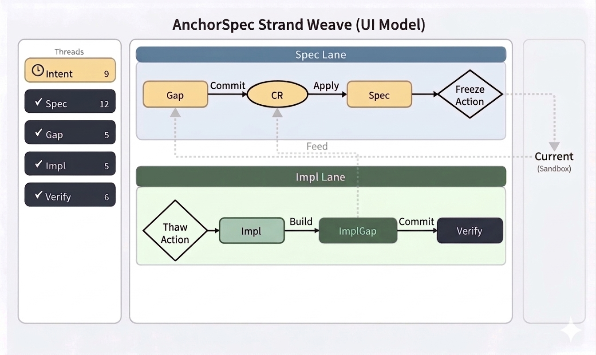

# AnchorSpec - Specification
# Thread Model

---

# スレッド間の関連性

---

# Vision Intent

- Why: なぜこれをやるのか  
- Goal: 達成したい状態  
- Good: 成功の定義  
- NG: やってはいけないこと  
- Scope: 対象 / 非対象  
- Notes: 前提・制約  

---

## Intentの決定  

各スレッド間は以下の関係となり、入出力では特定の手順を踏む必要があります。

| スレッド |  役割        |  入力方法     |
|---------|--------------|--------------|
| Intent  | 全体目標      |  ユーザ入力   |
| Spec    | 仕様管理      |  CR(Approve) |
| Gap     | 議論入口      |  ユーザ入力   |
| Impl    | 実装          |  Build Plan  |
| ImplGap | 実装議論入口   |  ユーザ入力   |

---

Intentは独立した単独のスレッドである。

ユーザー入力によるIntent(目的)の記載は認めるが、その他の変更方法は許可しない。

個人的なゴールやプロジェクトとしてのゴールを明確にしてここに記載する。   
Intentをどの粒度で使用するかはプロジェクトに委ねられる。   
例えば、自身が割り当てられたタスクの列挙や   
プロジェクトの期日までに入れなければならない機能、   
本当のデッドラインを記載し、絶対順守の目標とするなど、各々必要事項をIntent化する。   

Intentはプロジェクトの羅針盤である。   

---

## Spec

Specは、AnchorSpecにおける単一の不変な履歴保持主体である。
ここでの不変とは、スレッドのリロードにより常に同一の状態として再現可能であることを指す。

Specは常に成立していなければならず、
未確定・矛盾・仮説的な内容を含んではならない。

すべての変更はCRを経由してのみ反映され、
Approvedな変更のみがSpecに適用される。

Specは履歴としての連続性を保持し、
過去の状態および判断理由（Why）を失ってはならない。

既存のSpecを変更するのではなく、
新しいSpecとして追加されることでのみ更新される。

Specの更新は、ApprovedなCRの適用によってのみ行われる。

Specから既存の履歴を削除または改変してはならない。

FreezeはSpecの特定の時点を不変の参照点として固定する操作である。

各Freezeはバージョンとして扱われ、
以降の変更は新たな履歴として積み重ねられる。

必要に応じて、バージョン単位で独立したスレッドとして管理することができる。

- Source of Truth
- Approvedな変更のみ反映

# スレッド間依存関係

---

### Why（Lite）の定義（どこまで圧縮するか）

WhyについてはCoreだろうとLiteだろうとDeigneだろうと密度は同じ。(圧縮しない)

---

### SpecとCRの参照関係（ID）

Specは履歴参照のために、CRの参照先情報（ID）を保持してもよいが、CRの完全性はその参照先に依存しない。   
Specは、ApprovedとなったCRのIDを履歴参照情報として保持する。   

ただし、CRの完全性および再現性は保証されないため、SpecはCRを参照せずとも理解可能であるよう、   
Why（判断理由）を自己完結的に保持する必要がある。   
Whatは補助情報として保持してもよいが、Specの理解はWhyによって成立することを前提とする。   

Specへ転写される履歴情報は、原則としてWhy（判断理由）を中心とする。   
Whyは意思決定の根拠として自立して理解可能でなければならず、SpecはCRを参照せずとも成立することを前提とする。   

Whatは補助情報として保持してもよいが、Specの理解はWhyによって成立する。   

ImpactはCR内の検討情報として扱い、Specの履歴としては保持しない。   

AnchorSpecはLLMメモリの不信任としており、最低限Whyの厳守を原則とするため、   
外部永続ストレージを前提を必要とする場合がある。    
AIの揮発性メモリは永続的メモリ保存手段として扱わない方が得策である場合がある。   
通常は永続変数および半永続変数は、専用のスレッド上で管理される。   
しかし、そのメモリの揮発性が問題になりそうな場合は、外部ファイル「Markdows形式」で保存すべし。   

CRも基本的にはその保持先として専用スレッドを用い、必要に応じてThreadから再リードする。
ただし、再リードによって得られるCRは不完全になりうる。
そのため、SpecはCRが失われても意味を保てるよう、Whyを自立した形で保持する。

Whatは補助情報として扱う。

---

### Spec単体で理解できる粒度の保証

 判断理由が1回で理解できる程度

---

## Gap

すべての変化が流入する場所。

- 未定義
- 矛盾
- アイディア
- フィードバック

※ AnchorSpecの「入口」

---

### GapのActionItem機能

ActionItemは、Gapで扱う差分・議題を追跡可能な単位として管理するための構造である。
ActionItemは、議論の取りこぼしや未処理状態を防ぐためのガードレールとして機能する。

---

#### ActionItemのテンプレートプロンプト

ActionItemは、Gapに流入する差分・議題・アイデアなどから生成される。

テンプレート：
 [ ] 要件、タイトル、問題概要など任意の文字列

---

### GapのActionItem機能

ActionItemは、Gapで扱う差分・議題を追跡可能な単位として管理するための構造である。
ActionItemは、議論の取りこぼしや未処理状態を防ぐためのガードレールとして機能する。

---

## Gap feature登録単位
Specに登場する単位。   

例）
F-001 MetaInfo(リリースバージョン/開発者名など)
F-002 TODOリスト管理
F-003 TODOリスト追加
F-004 TODOリスト削除

---

### ActionItem Lifecycle

Add → Open → Active → Resolved → Closed → (Optional) Remove

---

### Tips: ActionItemの一括確認

Gapに蓄積されたActionItemは、

Status Index All

のようなコマンドを用いることで一覧確認できる。

これは必須の操作ではないが、
未処理の議題を可視化するために有効である。
(必要に応じて適宜コマンドを定義し使用することができるが、
これはAnchorSpecのサポート外である。)

---

#### ActionItem Lifecycle

Add → Open → Active → Resolved → Closed → (Optional) Remove

---

### Tips: ActionItemの一括確認

Gapに蓄積されたActionItemは、

Status Index All

のようなコマンドを用いることで一覧確認できる。

これは必須の操作ではないが、
未処理の議題を可視化するために有効である。
(必要に応じて適宜コマンドを定義し使用することができるが、
これはAnchorSpecのサポート外である。)

---

# Gap運用のActionItemでの状態変化
 - ActionItem：議題の状態管理。Store/Gap/Reject/Apploval。Applovalの場合のみ仕様に昇格する。
 - Lifecycle：議論の開始/議論の再構築/議論の再評価/帰結。などの履歴保存は何より優先される。
 - Feature ID：Gapから生成されたCRのライフサイクルである。ApplyすればSpec昇格。それ以外の判断はGapへ戻される・

---

## 🖥 UI Concept

### ポイント

- 左：スレッド管理（Intent / Spec / Gap / Impl / Verify）
- 上：Spec Lane（仕様パイプライン）： (Strand) -> Gap -> CR -> Spec => Freeze
- 下：Impl Lane（実装＋検証）： => Thaw -> ImplGap <-> Impl -> Freeze -> Verify
- 右：Current（実験サンドボックス）： Current -> Gap

※ Gitライクだが「思考」まで扱う   
※ CurrentはGapを経由しなければSpecへ昇格できない   
※ Spec及びImplGapで仕様不備が発覚した場合はGapにフォールバックする   
※ Strandは任意だが、分岐後のSpecは並列に保持し、必要なタイミングで選択を切り替える   

---

Previous : [スレッド定義](./05_thread_definition.md)

Next : [変更管理モデル](./07_change_management.md)

Back to : [Index](./index.md)
