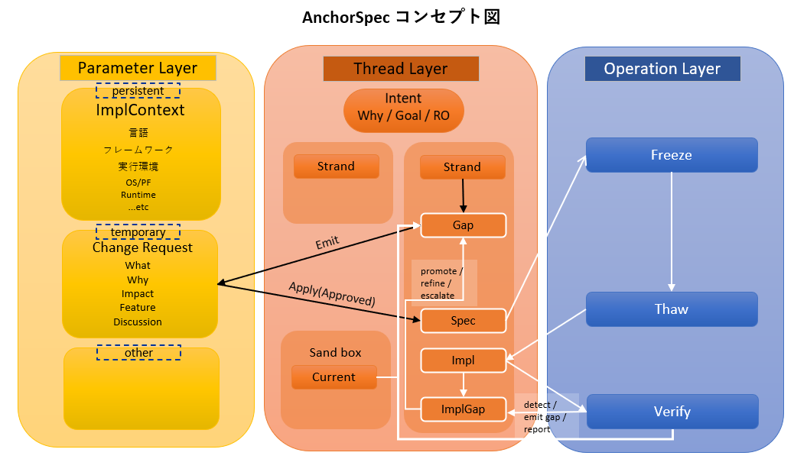
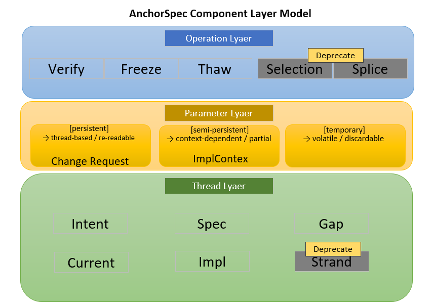

# AnchorSpec v2.3 — AI-Native Development Protocol

**Author**: ニア・アノマ  
**Co-Author (AI)**: マリー先生(ChatGPT)、ユーリ(Claude)、ライズ(Gemini)、ロゼ(Grok)

---

<<<<<<< HEAD
[Worning] 本ドキュメントはSemantic Load過多の為、仮対応として半分に分割します。分割単位に意味はありません。   

---

=======
>>>>>>> origin/main
## 🧭 Overview

> AnchorSpecは「思考・仕様・実装」を分離し、再接続する開発プロトコルである。

AnchorSpecはAI協働開発のための構造化プロトコルである。

本バージョンでは、従来の状態遷移モデルに加え、

並行開発を扱うための構造拡張（Strand）が導入された。

- スレッド分離
- 意図駆動（Intent Driven）
- 差分管理（Gap / CR）
- 検証（Verify）
- 凍結（Freeze）

により、開発の混乱・破綻・属人化を防ぐ。

👉 AI時代における「仕様迷子」を防ぐための開発プロトコル

---

## 一言でいうと

👉 「ズレをGapに集めて、CRで整理し、Specに反映する」

---

# 🧠 Summary

AnchorSpecは

**「思考（Intent）・仕様（Spec）・実装（Impl）を分離し、  

差分（Gap）と検証（Verify）によって安全に進化させる開発プロトコル」**

である。

---

## なぜAnchorSpecか

AIを用いた開発では以下の問題が発生する。

-   コンテキストの崩壊
-   仕様の不整合
-   過去議論の追跡困難
-   思いつきによる仕様の破壊

AnchorSpecはこれらを解決するために

-   スレッド分離
-   変更プロセスの強制
-   履歴の明確化

を提供する。

---

AnchorSpecは

**AIと人間が共同で開発を行うためのスレッド分割型開発手法である。**

開発対象の

**仕様・議論・実装・履歴**

を役割ごとに分離したスレッドで管理する。

**スレッド構造は最終的に人間によって決定される。**

---

# 問題構造（Problem Structure）

「コンテキストが長くなるとAIの精度が低下する」という現象自体は、多くの人に知られている。

従来、この問題は主にトークン数や指示間距離といった**物理的な指標**によって説明されてきた。

しかし実際には、同じ長さのコンテキストであっても、内容によって挙動が大きく変化することがある。

Semantic Loadは、この差異を説明するために導入された概念であり、
コンテキストの長さではなく、**意味の密度および依存関係の総量**という観点から問題を捉える。

---

## Context Drift（コンテキストドリフト）

Context Driftとは、
**コンテキスト内において、本来保持されるべき前提・意図・参照関係がズレ、再現性と整合性が失われる現象**を指す。

このズレは明示的な変更によって発生するものではなく、
コンテキストの更新や構造的な矛盾処理の過程で、暗黙的に発生する。

Context Driftは、少なくとも以下の2つの経路によって発生する：

### 1. Load蓄積型（Accumulation Drift）
- トリガー：Semantic Loadの蓄積
- 特徴：徐々に進行する
- 挙動：重要度の重み付けが不安定化する
- 速度：緩やか
- 検出：困難（気付いた時には進行している）
### 2. 衝突型（Conflict Drift）
- トリガー：二律背反・矛盾する前提の混在
- 特徴：AIが矛盾を無言で解釈・解消しようとする
- 挙動：前提の一部が暗黙的に破棄・改変される
- 速度：即時
- 検出：極めて困難（1ターンで発生しうる）

特に衝突型は、コンテキストの長さに依存せず発生し、
短い会話であっても一度のやり取りで重大なズレを引き起こす可能性がある。

このため、「コンテキストが長くなると危険である」という一般的な理解だけでは不十分である。

Context Driftの主要因のひとつはSemantic Loadの増加であるが、
それはあくまで一経路であり、すべてのDriftを説明するものではない。

なお、Context Driftの発生および進行度は厳密に測定することが困難であり、
本仕様ではその検知および対応の判断をユーザーに委ねる。

---

### Load蓄積型ドリフト（Accumulation Drift）

Load蓄積型ドリフトとは、
**Semantic Loadの増加に伴い、コンテキスト内の重要度の重み付けが徐々に崩壊し、結果として整合性と再現性が失われていくドリフト経路**である。

このドリフトは、明確なトリガーを持たず、
情報の追加・議論の継続・参照関係の増加といった通常の操作の中で発生する。

初期段階では大きな破綻は観測されないが、
Semantic Loadの蓄積により以下のような変化が現れる：

- 重要な前提と補助的な情報の区別が曖昧になる
- 参照すべき情報の優先順位が不安定になる
- 出力の一貫性が徐々に低下する

この進行は連続的かつ不可逆的であり、
一定の閾値を超えると、コンテキスト全体の整合性が急激に失われる場合がある。

Load蓄積型ドリフトは検出が難しく、
明確な異常として認識される頃には既に進行していることが多い。

このドリフトは、コンテキストの長さに依存する場合もあるが、
本質的には長さではなくSemantic Loadの蓄積量に依存して発生する。

---

### 衝突型ドリフト（Conflict Drift）

衝突型ドリフトとは、
**コンテキスト内に矛盾する前提・制約・仕様が同時に存在した際に、AIがそれらを整合的に解釈しようとする過程で、前提の一部が暗黙的に破棄・改変され、結果として整合性が失われるドリフト経路**である。

このドリフトは、明確なトリガーを持つ点でLoad蓄積型とは異なり、
**矛盾または二律背反の発生を契機として即時に発生する。**

衝突型ドリフトでは、以下のような挙動が観測される：

- 矛盾する条件の一部が明示されないまま無視される
- 複数の前提が統合されたかのように再解釈される
- 既存の仕様や意図が部分的に書き換えられる
- 一見整合しているように見えるが、内部的には前提が破綻している

このプロセスは非明示的に行われるため、
ユーザーが認識しないままコンテキストの構造が変質する。

衝突型ドリフトは、コンテキストの長さに依存せず、
**単一のやり取り（1ターン）で致命的な破綻を引き起こす可能性がある。**

このため、衝突型ドリフトは最も危険度の高いドリフト経路であり、
発生後に元の整合状態を復元することは極めて困難である。

一般的な対話操作によってこのドリフトを防止することはできず、
**構造的にコンテキストを固定・分離する手段（例：Freeze / Thaw）を用いない限り、完全な回避は困難である。**

また、このドリフトは検出が極めて困難であり、
特に出力が一見妥当に見える場合、異常として認識されにくい。

このドリフト経路は、後述するStructural Lieと強く関連する。

---

### 各Drift経路の典型例

各ドリフト経路は、実際の対話において以下のような形で観測される。
これらは特定の条件に限らず、一般的なAIとの対話において誰にでも発生しうる。

---

### Context Driftの初期兆候（Early Signal）

出力結果が意図と異なり、その異なり方に一貫性の崩れや既視感のあるズレが観測される場合、Context Driftの発生を疑うべきである。
これはあくまで初期兆候の一例であり、単独では確定的な指標ではない。

---

#### Load蓄積型ドリフトの典型例

長時間の対話や複雑な議論を継続した場合、
Semantic Loadの蓄積により、コンテキストの重み付けが徐々に崩れていく。

例：

- 初期に定義した重要な前提が、後半の出力で参照されなくなる
- 仕様の一部が抜け落ちた状態で処理が進行する
- 過去に確定した内容が、再び未確定の前提として扱われる
- 「さきほど決めた内容」と「現在の出力」が一致しない

これらは単発のエラーではなく、
対話の継続に伴って徐々に発生頻度が増加する傾向を持つ。

初期段階では違和感としてしか認識されないが、
進行するとコンテキスト全体の整合性が失われる。

---

#### 衝突型ドリフトの典型例

矛盾する条件や制約が同時に提示された場合、
AIはそれらを明示的に解消せず、内部的に解釈・調整を行う。

例：

- 「Aという制約を守る」とした後に、「Aを満たさない条件」を追加した場合、Aが無言で破棄される
- 既存の仕様と整合しない新しい要求を追加した際、既存仕様が部分的に書き換えられる
- Intentと矛盾する提案を行った場合、それがあたかも整合しているかのように出力される
- 矛盾する複数の前提が“それっぽく統合された状態”で提示される

これらの挙動は、単一のやり取りの中で発生しうる。

特に危険なのは、
出力が一見正しく見えるため、問題が認識されにくい点である。

その結果、ユーザーが気付かないまま誤った前提が確定し、
以降のすべての処理に影響を与える可能性がある。

---

## Semantic Load（意味負荷）

Semantic Loadとは、
**コンテキスト内に存在する「意味の総量」を指す概念である。**

ここでいう意味とは、単なるテキスト量ではなく、以下のような要素を含む：

- 目的（Intent）
- 制約条件
- 仕様およびその依存関係
- 過去の議論および参照構造
- 現在の状態に関する前提

Semantic Loadは、これらの情報が蓄積されることで増加する。

重要なのは、Semantic Loadはテキスト量と一致しない点である。
短い会話であっても意味密度が高ければ負荷は大きくなり、
長文であっても意味的に単純であれば負荷は小さい場合がある。

Semantic Loadが増加すると、
コンテキスト内における重要度の重み付けが不安定になり、
結果としてコンテキストドリフトが発生しやすくなる。

この現象は、会話の長さに依存せず発生しうる。

なお、Semantic Loadの厳密な測定は困難であり、
本仕様ではその評価および運用判断をユーザーに委ねる。

---

### Semantic Loadの蓄積判断シグナル

Verifyにより差異や不整合が継続的に検出され、Gapが収束せず持続する場合、Semantic Loadの過剰な蓄積を疑うべきである。
これはあくまで判断シグナルの一例であり、確定的な指標ではない。

---

### Semantic Loadの推定方法

- 文脈に影響せず、参照されない情報はLoadとして蓄積されにくい
- 参照される情報は形式に関わらずLoadとなる
- 非構造的な発言(雑談・比喩・仮置き)が構造に影響し始めた場合、Loadの増加とみなす

**軽い発言が思い依存になる瞬間がある**

---

### 大量入力によるSemantic Load急増リスク

**大量入力は、Semantic Loadの“瞬間的な上書き”を引き起こす可能性がある。**

大量入力とは、
**一度の操作で大量の情報（例：長文・ファイル・複数仕様）をコンテキストに投入する行為**を指す。

このような入力は、Semantic Loadを連続的ではなく**非線形に急増させる**特性を持つ。

その結果、以下のようなリスクが発生する：

- 既存コンテキストとの重み付けが崩壊する
- 重要な前提が埋没する
- 参照関係が不安定化する
- 衝突型ドリフトを誘発する可能性がある

特に、既存の文脈と強く結合した場合、
Load蓄積型ドリフトの加速または衝突型ドリフトの発生を引き起こす可能性がある。

この現象は、入力内容の正しさとは無関係に発生しうる。

なお、どの程度の入力量が危険となるかは環境およびコンテキストに依存するため、
本仕様では明確な閾値は定義せず、運用上の判断をユーザーに委ねる。

---

### Semantic Loadが影響するスレッド範囲

Semantic Loadは特定のスレッドに限定されるものではなく、
**すべてのスレッドに影響を及ぼす。**

ただし、その影響の現れ方はスレッドの役割によって異なる。

---

#### Spec

SpecはSource of Truthであり、直接的に破壊されることはない。
しかし、未整理の状態で情報が蓄積された場合、Semantic Loadの発生源となる。

特に、Freezeされていない状態での肥大化は、
参照負荷の増大および理解コストの上昇を引き起こす。

---

#### Gap

GapはSemantic Loadの影響を最も強く受ける領域である。

議論の混線
差分の肥大化
収束困難

などの形で影響が顕在化する。

Semantic Loadの増加により、Gapは整理されない差分の集合となり、
構造的な把握が困難になる。

---

#### Current

Currentは非構造的なサンドボックスであるため、
Semantic Loadの影響を直接的かつ不安定な形で受ける。

前提の揺らぎや出力の一貫性低下が発生しやすく、
コンテキストドリフトの影響が顕在化しやすい。

---

#### Impl

ImplはSpecの具体化であるが、
Semantic Loadの影響により、Specとの整合性が維持しづらくなる。

結果として、差異の増加やImplGapの肥大化が発生する。

---

#### Verify

Verifyは状態を持たない非破壊オペレーションであるため、
Semantic Loadによって直接的に破壊されることはない。

しかし、Semantic Loadが高い状態においては、
検出される差異・不整合の量が増加する。

---

その結果：

* mismatchの増加
* open questionsの増加
* Gapへの出力の増加

が発生し、Gapの肥大化を引き起こす。

このため、VerifyはSemantic Loadの影響を受けて
**結果的にそれを増幅する要因となる場合がある。**

---

#### まとめ

Semantic Loadはすべてのスレッドに影響を及ぼすが、
その影響はスレッドの役割に応じて異なる形で現れる。

特にGapは主要な影響点であり、
Verifyはそれを増幅する要因となりうる。

---

### Semantic LoadとVerifyの関係

Verifyは、Spec・Impl・Intentなどの参照関係に基づき、差異や不整合を検出するための非破壊オペレーションである。

VerifyはSemantic Loadそのものを直接測定・評価する機構ではないが、
**Semantic Loadの増加に伴って発生する不整合や揺らぎを通じて、その影響を間接的に観測することができる。**

Semantic Loadが低い状態では、Verifyの出力は安定し、差異は限定的である。
一方で、Semantic Loadが高い状態では、以下のような変化が現れる：

* 検出される差異の増加
* mismatchの粒度の不安定化
* open questionsの増加

このため、Verifyの出力傾向はSemantic Loadの状態を反映する指標のひとつとして扱うことができる。

ただし、VerifyはSemantic Loadの制御や削減を目的とした機構ではない。

Verifyは差異の検出のみを担い、
検出された内容はGapへフィードバックされる。

したがって、Semantic Loadの増加に伴いVerifyの出力が増加した場合、
その結果はGapの肥大化を引き起こし、結果的にSemantic Loadをさらに増加させる可能性がある。

このように、VerifyはSemantic Loadの影響を受けると同時に、
その影響を増幅する要因として機能する場合がある。

重要なのは、
**VerifyはSemantic Loadを解決しない**という点である。

Semantic Loadの管理および対処は、
構造の分離・整理・凍結といった運用によって行われるべきであり、
Verifyはそのための観測および検出を担う補助的な役割にとどまる。

---

## Structural Lie（構造的虚偽）

Structural Lieとは、
**コンテキスト内において、一見整合しているように見えるが、実際には前提・制約・参照関係のいずれかが破綻しており、構造的に成立していない状態を指す。**

この状態では、出力は表面的には妥当に見えるが、
内部的には以下のような問題を含む：

- 前提条件の一部が欠落または改変されている
- 矛盾する条件が未解決のまま共存している
- 参照関係が断絶または再解釈されている
- 意図（Intent）との整合性が保証されていない

Structural Lieは、単なる誤りや不整合とは異なり、
**「成立しているように見える」という性質を持つことが本質的な特徴である。**

このため、明示的なエラーとして検出されにくく、
ユーザーが正しい状態であると誤認する危険性が高い。

Structural Lieは、主に衝突型ドリフト（Conflict Drift）の結果として発生するが、
Load蓄積型ドリフトの進行によっても誘発される場合がある。

一度Structural Lieが成立したコンテキストは、
その内部整合性を信頼することができず、
以降のすべての処理に影響を与える可能性がある。

なお、Structural Lieの厳密な検出は困難であり、
本仕様ではその認識および対処の判断をユーザーに委ねる。

---

### Structural Lieの検出サイン

Structural Lieは、表面的には整合しているように見えるため、
明確なエラーや不整合として直接検出することは困難である。

しかし、以下のような状況において、その存在が疑われる：

* 出力が一貫しているにも関わらず、意図との整合性に違和感がある
* Verifyにおいて重大な不整合が検出されないにも関わらず、結果に不自然さが残る
* 同一コンテキストを再利用した際に、前提の解釈が変化する

また、FreezeおよびThawなどの構造操作を行った際、
それまで成立していたはずの整合性が崩れる場合がある。

これは、コンテキストの再構成によって暗黙的な前提が露呈するためであり、
Structural Lieが内在していた可能性を示唆する。

これらはあくまで検出サインの一例であり、
Structural Lieの発生を確定するものではない。

---

### Structual Lieのパターン

以下はStructual Lieの代表的なパターンである。

#### ① 欠落型（Omission）
* 前提・条件・仕様の一部が消える
* でも成立しているように見える

例：

* ファイルの途中が欠落している
* 重要な条件が抜けたまま進行

#### ② 再解釈型（Reinterpretation）
* 元の前提を都合よく書き換える

例：

* Intentを“解釈”してズラす
* 制約を弱める・無視する

#### ③ 擬似統合型（False Integration）
* 矛盾しているものを“それっぽく”まとめる

例：

* Aと非Aを同時に満たすような説明
* 両立しない仕様を自然に融合

これらはあくまでパターンの代表的な例であり、
全てのパターンを網羅するものではない。

---

### Structural LieとContext Driftの関係

Context Driftは、コンテキスト内における前提・意図・参照関係のズレが進行する現象であり、
Structural Lieは、その結果として生じる**構造的に成立していない状態**である。

すなわち、両者の関係は以下のように整理される：

* Context Drift：進行中のズレ（現象）
* Structural Lie：ズレが固定化された状態（結果）

Context Driftが進行すると、前提の欠落・再解釈・擬似統合などが発生し、
その結果としてStructural Lieが形成される。

特に衝突型ドリフト（Conflict Drift）は、
単一のやり取りの中でStructural Lieを生成しうる経路であり、
両者は強く結びついている。

一方で、Load蓄積型ドリフト（Accumulation Drift）は、
段階的なズレの蓄積を通じてStructural Lieを誘発する。

このように、Structural Lieは単独で発生するものではなく、
多くの場合Context Driftの進行過程において生成される。

また、Structural Lieが成立した状態では、
コンテキストの内部整合性が失われているにも関わらず、
その状態が一見正常に見えるため、
以降のContext Driftの検出をさらに困難にする。

したがって、両者は以下の関係を持つ：

* Context DriftはStructural Lieを生む
* Structural LieはContext Driftの検出を困難にする

この相互作用により、問題は自己増幅的に進行する可能性がある。

なお、これらの関係は概念的整理であり、
すべてのケースにおいて厳密に分離可能であるとは限らない。

---

## Structual Reset(再構築)

Structural Reset（再構築）とは、コンテキストドリフトや不整合によって破綻した状態に対し、Specを基準として構造を強制的に再構成する破壊的操作である。
この操作は、現在のコンテキストを部分的または完全に破棄する可能性を持ち、回復手段であると同時に状態のリセットを伴う高リスク操作として扱われる。

---

### 「支持の撤回指示」と「過去のコメント編集」の違い

| 操作        | 概要                    | 影響                               |
| :-------- | :-------------------- | :------------------------------- |
| 指示の撤回     | 新たなコメントによって過去の指示を取り消す | 過去のコンテキストは残存し、解釈によるズレが発生する可能性がある |
| 過去のコメント編集 | 過去のコメントそのものを修正する      | コンテキストの履歴が書き換わり、状態をやり直すことができる    |


---

### リカバリーの可能性の範囲(完全/部分)

リカバリー可能性とは、Structural Reset（再構築）によって、Specとの整合状態をどの程度まで回復可能であるかを示す指標である。

本仕様では、リカバリー可能性を以下の2種類に分類する。

・完全リカバリー（Full Recovery）
Specに対する整合状態を完全に再現可能であり、意図・参照関係・状態認識が破綻なく復元される状態。

・部分リカバリー（Partial Recovery）
Specとの整合は回復されるが、意図・参照関係・状態認識の一部に欠落または再解釈が発生する状態。

---

### 回復不能状態の条件

回復不能状態とは、Structural Reset（再構築）を実行してもSpecとの整合状態を再現できない状態を指す。

本仕様では、以下のいずれかの条件を満たす場合、回復不能と判定する。

* 汚染（不整合・誤った解釈・構造的ズレ）がSpecまたはImplに既に反映されている場合
* 汚染発生以前の正しい状態を参照可能なFreezeポイントが存在しない場合

---

### リカバリー条件例のチェックリスト

リカバリー条件チェックリスト：

以下の項目を満たす場合、Structural Reset（再構築）による回復が可能であると判断できる。

* 汚染がSpecに反映されていない
* 汚染がImplに反映されていない、または影響範囲が特定可能である
* 汚染発生以前のFreezeポイントが存在する
* Freezeポイントの内容が正当なSpec状態として信頼できる
* 現在のズレ（Intent／参照関係／状態認識）が特定できている
* 再構築後に参照すべきSpecが明確に定義されている
* Structural Resetの実行による影響範囲（破棄対象）が把握されている

いずれかが満たされない場合、部分リカバリーまたは回復不能状態となる可能性がある。

---

### Verify→Gap→CR→Specの回復フロー

Verify→Gap→CR→Specの回復フローとは、不整合やズレを検出し、直接修正せずに構造的に回復させるための一連のプロセスである。

1．Verify
各Thread（Spec／Impl／Current）に対して整合性検証を行い、不整合・未定義挙動・ズレを検出する。
この段階ではいかなる修正も行わず、検出のみに限定する。

2．Gap
Verifyで検出された内容はすべてGap Threadへ集約される。
Gapでは、不整合の内容・影響範囲・再現条件などを整理し、構造的な問題として記録する。

3．CR（Change Request）
Gapで整理された内容をもとに、修正提案としてCRを作成する。
CRは、Specをどのように変更すべきかを明示し、Draft／Reviewed／Approvedのステータスを持つ。

4．Spec
ApprovedとなったCRのみがSpecへ反映される。
Specは唯一の正として更新され、以降の整合性判断の基準となる。

このフローにおいて、直接的なThread編集は禁止される。
すべての回復操作は、GapおよびCRを経由してSpecへ反映されることで、構造的な整合性が維持される。

編集によるリカバリは、以下の範囲に限定して許可される。

* Current Thread
　一時的な作業領域であり、信頼されない状態として自由な編集が可能
　誤りの修正・再試行・試験的変更はここで行う
* Impl Thread
　実装過程の修正として限定的に編集可能
　ただし、Specとの整合を前提とし、構造的変更は許可されない
* ImplGap Thread
　実装上の差分・問題の整理として編集可能
　ただし、修正そのものではなく、問題の記録・分析に限定される

以下のThreadは直接編集によるリカバリを禁止する。

* Spec Thread
　唯一の正であり、CRを経由しない直接編集は禁止
* Gap Thread
　検出内容の記録領域であり、都合の良い書き換えは禁止

この制約により、「直接編集による回復」は局所的・一時的な対応に限定され、構造的な回復は必ずVerify→Gap→CR→Specのフローを経由する。

---

## 🧑‍💻 人間側が負う責務

AnchorSpecにおいて、

**構造（スレッド / Feature / CRの境界）は人間が決定する。**

AIは以下を担う：

- 内容の生成
- 整理の補助
- 検証（Verify）

ユーザーは構造（Intent、Select、最終的なSpecの確定）に対する決定権を持つ。

AIは、Gapの生成、CRの提案、実装支援などの補助的役割を担うが、
構造を確定する権限は持たない。

---

## UI/UX Principles

構造決定操作（Intent編集、Select、Spec確定）は、
AIの提案操作（CR生成、Gap提案、実装支援）と明確に区別して表示されなければならない。

構造決定操作はPrimaryとして強調表示し、
AIによる提案はSecondaryまたはSuggestionとして扱う。

未承認の変更はPendingとして明示される必要がある。

---

## 理由

構造はIntentと強く結びつくため、  

自動化するとズレが拡大する。

---

## 重要ルール（Principles）

- Specを直接編集しない  
- すべての変更提案はGapを経由してCRとして整理される
- Specへの反映はApprovedなCRのみを通じて行われる
- Verifyは修正しない  
- Currentは採用しない（必ずGapへ）
- Strandはマージしない（収束はSelectで行う）
- 構造の決定権は常に人間にある
- AIは構造を提案できるが確定してはならない
- Specは常に成立していなければならない

構造の確定は、いかなる場合もユーザーの明示的操作によってのみ行われる。

AIは構造の変更・生成・統合を提案することはできるが、
自律的に確定してはならない。

---

## 操作権限

- Intent編集：ユーザーのみ
- Select（Strand選択）：ユーザー主体（AIは候補提示のみ）
- Spec確定（Apply）：ユーザー承認が必須
- CR生成：ユーザー / AI 両方可能
- Gap生成：主にAI（検知・提案）

---

## Thread（スレッド）

スレッドとは

**1つのチャット（会話単位）**である。

-   独立した文脈
-   固有の役割
-   個別の履歴

を持つ。

履歴は不変であり、変更は新規発言として追加される。

---

## 基本スレッド

AnchorSpecでは

**1つのProjectに以下の基本スレッドが存在する。**

■ Core Threads
- Intent
- Spec
- Gap

■ Execution Threads
- Impl
- ImplGap(任意)

■ Sandbox
- Current

---

### コメント入力型ヘッダコメントテンプレート

#### 最小構成

```
Project: <project_name>
Version: <version>
Thread: <type>
```
各スレッドの先頭に必ずこのヘッダを記述する。

#### Thread type
Threadのtypeには以下のいずれかを必ず入力する。
AIの誤認を避けるため、大文字・小文字は区別する。
- Intent
- Spec
- Gap
- Impl
- Verify
- Strand（必要な場合）

例：

 ```
 Project: TODOリストアプリ開発
 Version: v0.0.1
 Thread: Spec
 ```

---

### スレッドコマンド

スレッドコマンドは、各スレッドで扱うことが出来るコマンドである。
スレッドコマンドには、全スレッド共通で使用できるもの（共通コマンド）と、
各スレッド特有のもの（ローカルコマンド）が存在する。

---

### ローカルコマンド

ローカルコマンドは、特定のスレッドにおいてのみ定義されるコマンドである。

- Gapスレッド：
  - add：ActionItemを追加する
  - open：指定IndexのActionItemを開始する
  - resolve：対応完了として処理結果を記録する
  - close：ActionItemを終了する
  - status：ActionItemの状態を確認する
  - clear：ActionItem Listを初期化し、全項目を一覧から削除する（履歴は保持される）

- CRスレッド：
  - create：Gapで整理された内容をもとに、新しいChange Requestを作成する
  - review：作成されたCRの内容を検証し、妥当性・影響範囲・整合性を確認する
  - approve：レビュー済みのCRを承認し、Specへ反映可能な状態にする

- Specスレッド：
  - apply：ApprovedなCRをSpecへ反映する

---

### 制御コマンド

以下のコマンドは構造全体に作用する操作として使用する。

- verify：整合性検証を実行し、不整合を検出する
- freeze：現在のSpec状態を固定(スナップショット)する
- thaw：Freeze状態から復元(チェックアウト)する
- print：現在のThread状態または構造を出力する
- index：項目一覧（Spec／ActionItem等）を表示する
- how：コマンドの使用方法を表示する
- man：コマンドの詳細説明を表示する

**制御コマンドは任意のThreadから実行可能である**
**ただし、Semantic loadの蓄積を防ぐため、実行Threadを制限または分離することが推奨される**

---

### コマンドの使用例（CLI形式）

#### ActionItemの開始
open index 3

#### 状態確認
status index all

#### 整合性検証
verify

#### 差分の確認
print spec

#### 一覧表示
index spec

#### CRの作成
create cr "Specの不整合修正"

#### CRのレビュー
review cr 1

#### CRの承認
approve cr 1

#### Specへの反映
apply cr 1

#### Specの固定
freeze spec v1.2.0

#### 状態の復元
thaw spec v1.2.0

---

### 基本操作フロー（開始〜完了）

基本操作フロー（開始〜完了）：

1．開始
ActionItem Listを参照し、対象となるIndexを決定する
open index N

2．対応（検出・整理）
必要に応じてverifyを実行し、不整合・未定義挙動を検出する
検出内容はGapとして整理される

3．検討（CR作成）
Gapで整理された内容をもとにCRを作成する
create cr "タイトル"

4．検証（レビュー）
CRの妥当性・影響範囲・整合性を確認する
review cr N

5．承認
問題がなければCRを承認する
approve cr N

6．反映
承認されたCRをSpecへ反映する
apply cr N

7．確認
反映後の状態を確認する
verify

8．完了
対応内容を確定し、ActionItemを終了する
close index N

このフローにより、検出から修正・反映までが一貫した構造で管理される。

---

### アンチパターン(コマンド編)：誤コマンド入力

誤コマンド入力とは、現在のスレッドで定義されていないコマンドを実行する行為である。

これは未定義の動作（Undefined Behavior）となり、
意図しない状態遷移や不正な処理を引き起こす可能性がある。

誤コマンド入力は主に以下の要因によって発生する：

- スレッドの文脈を認識していない
- コマンドのスコープ（共通 / ローカル）を誤認している
- AIが現在のスレッドを意識せず応答を生成する

AnchorSpecは未定義コマンドの安全な実行を保証しない。
したがって、定義されていないコマンドは無効として扱うことを前提とする。

* 誤コマンド入力
* 未定義動作

---

### 設計原則

* 非破壊
* 明示的状態管理
* 推測による補完を行わない

---

未定義のコマンドは実行してはならない。

---

#### もしも誤コマンドを発行してしまったら？

→ 慌てず、即座にコマンドを記述したコメントを編集し、コマンドを取り消しましょう。  
その段階であれば、まだ軌道修正できる可能性があります。

大半の誤コマンドは、AIが現在のコンテキストに合わせて解釈・補完しようとすることで、
意図しない挙動を引き起こす場合があります。

ただし、その影響は限定的であることが多く、
多くの場合はコメントの修正や再指示によってリカバリーが可能です。

過度に恐れる必要はありませんが、
コマンド実行後の挙動には注意を払い、違和感があれば速やかに修正してください。

誤コマンド実行の結果、違和感のある挙動となった場合はGapとして扱い、
必要に応じてActionItemとして記録することもできます。

---

## 🔁 状態のライフサイクル

AnchorSpecは以下の状態遷移を持つ：

Gap → CR → Spec → Freeze → Thaw → Impl → Verify → Gap(ImplGap)

---

## 🧱 構造モデル

AnchorSpecは2軸構造を持つ：

- 縦軸：状態遷移（Lifecycle）
- 横軸：Strand（並行Specライン）

各Strandは独立した状態遷移を進行し、

Selectによって収束する。

---

## ステートマシン原則

AnchorSpecは状態遷移を持つステートマシンとして解釈される。

各要素は状態ノードであり、各操作は状態遷移として定義される。

---

## 🧠 Concept Diagram

<<<<<<< HEAD

=======

>>>>>>> origin/main

### ポイント

- Intentが最上位
- Gapにすべてが収束（入口）
- Verifyによるズレ検出
- Currentによる未責任領域の隔離

---

## Structure Model

<<<<<<< HEAD

=======

>>>>>>> origin/main

### ポイント

- 上：Operation Layer (Verify / Freeze / Thaw / Select / Splice)
- 中：Parameter Layer (ImplContext)
- 下：Thread Layer (Intent / Spec / Gap / Current / Impl / Strand)

---

## 🖥 UI Concept

<<<<<<< HEAD

=======

>>>>>>> origin/main

### ポイント

- 左：スレッド管理（Intent / Spec / Gap / Impl / Verify）
- 上：Spec Lane（仕様パイプライン）： (Strand) -> Gap -> CR -> Spec => Freeze
- 下：Impl Lane（実装＋検証）： => Thaw -> ImplGap <-> Impl -> Freeze -> Verify
- 右：Current（実験サンドボックス）： Current -> Gap

👉 Gitライクだが「思考」まで扱う
👉 CurrentはGapを経由しなければSpecへ昇格できない
👉 Spec及びImplGapで仕様不備が発覚した場合はGapにフォールバックする
👉 Strandは任意だが、分岐後のSpecは並列に保持し、必要なタイミングで選択を切り替える

---

## Layer Definitions

### AnchorSpec Layer Model

AnchorSpecは、役割の異なる情報を混在させないために、構成要素を複数のLayerとして整理する。
各Layerは「何を保持するか」「何を変更できるか」「何を信頼してよいか」が異なる。

本モデルの目的は、AI協働開発において発生しやすい文脈混線・仕様ドリフト・暗黙依存を減らし、
意図・状態・操作・補助条件を分離して扱うことにある。

---

### 1. Thread Layer

Thread Layerは、開発中の実体となる状態や記録を保持するLayerである。
Intent / Spec / Gap / Current / Impl / Strand など、AnchorSpecにおける主要な作業対象はこのLayerに属する。

Strandは、これらのThreadを束ねる前提単位の論理的な区分であり、
各Threadは特定のStrandに属する形で管理される。

このLayerに属する要素は、単なる補助情報ではなく、
参照・検討・更新の対象となる正式な開発コンテキストである。

Thread Layerは、開発の現在地・差分・仕様・実装状況を分離して保持することで、
異なる種類の情報が同一スレッド内で混線することを防ぐ。

#### Characteristics
* 開発対象そのものを保持する
* 状態として参照される
* 差分・検証・凍結の対象になる
* Source of Truthになり得る要素を含む

---

### 2. Operation Layer

Operation Layerは、Thread Layer上の状態に対して作用する操作を定義するLayerである。
Verify / Freeze / Thaw / Select / Splice などはこのLayerに属する。

Operation Layerの要素は状態そのものではない。
それらは、あるThreadを変更・固定・再開・選択・再構成するための作用である。

つまりOperation Layerは、
「何が存在しているか」ではなく、
**「それらをどう扱うか」**を定義する。

---

#### Characteristics
* 状態そのものは保持しない
* Thread間の関係や変化を引き起こす
* 入出力や結果を伴う
* 単独では意味を持たず、Thread Layerに作用して意味を持つ

---

#### Purity of Operation

Operation Layerの各操作は、入力となるThreadおよびParameter（CRを含む）を変更してはならない。

これらはすべて参照専用の入力として扱われ、
Operationはその内容に基づいて結果を生成するが、
入力自体に副作用を与えない。

必要な変更は、Operationの結果として新たなThread（例：Gap）へ出力される。

---

### 3. Parameter Layer

**Parameter Layerは、ThreadやOperationの解釈・挙動・運用条件に影響を与える補助的な条件群を保持するLayerである。**

Parameter Layerは、AI協働において発生する「暗黙の前提」を管理可能な形に押し戻すためのLayerである。

AIはしばしば、記憶している設定・過去の会話・曖昧な慣習に基づいて振る舞う。
しかし、それらは人間から常に見えるとは限らず、永続性や再現性も保証されない。

AnchorSpecは、このような不可視な依存をそのまま信頼しない。
Parameter Layerは、そうした前提条件を必要に応じて明示し、
「覚えているから使う」ではなく、「見えるから使える」状態へ戻すために存在する。

ここに属する情報は、仕様本文そのものではないが、
AIや人間がAnchorSpecをどう運用するかを左右する。

例:

* 実装言語
* フレームワーク
* 出力形式
* 運用上の制約
* 一時的な作業ルール
* セッション固有の補助条件
* 永続的に共有したい前提条件

Parameter Layerは、**「状態」ではなく「解釈条件」**を扱う。
また、**仕様の正式な昇格先ではなく、運用条件の保持場所である。**

---

#### Memory and Trust

Parameterには、AIの会話メモリや外部メモリ機構に保持されるものが含まれる場合がある。
しかし、それらの記憶は常に永続・完全・可視・制御可能であるとは限らない。

そのためAnchorSpecでは、
**AIが覚えていることを前提にParameterを信頼してはならない。**

記憶に依存するParameterは便利ではあるが、
それはあくまで補助的キャッシュであり、正式なSource of Truthではない。

重要なParameterは、必要に応じてThread上に明示的に書き戻し、
人間とAIの双方から再参照できる状態にすることが望ましい。

Parameter LayerにおけるRAM的データは、
スレッドを用いた疑似的な情報保持によって実現される。

これらのデータは再リード時に完全性が保証されず、
特にCRにおいては一部情報が欠落した状態で参照される可能性がある。

CRは構造的には完全なデータとして定義されるが、
Parameter Layerにおいて参照される際には、
その再現性および完全性は保証されない。

不完全なCRはそのまま信頼してはならない。
必要に応じてGapに再投入し、再構築または再検証を行う。

---

#### Design Principle
* Parameterは運用を助けるが、仕様を代替しない
* AIメモリ上のParameterは不完全である可能性を前提とする
* 重要なParameterは明文化されるまで信頼しない
* 必要なら永続Parameterと一時Parameterを区別して扱う

#### Characteristics
* 状態そのものではなく、解釈条件を与える
* Thread / Operationの挙動に影響する
* 永続のものと一時的なものがある
* 暗黙化しやすいため、可視化が推奨される
* Source of Truthではなく、補助条件である

---

## Short Definitions

Parameter Layerは、運用上の前提条件を扱うLayerである。
それらは挙動に影響を与えうるが、見えない依存関係になってはならない。

* Thread Layer: 開発中の実体となる状態・記録を保持するLayer
* Operation Layer: Thread Layer上の状態に作用する操作を定義するLayer
* Parameter Layer: ThreadやOperationの解釈・運用条件を与える補助情報を保持するLayer

---

### Parameter

ParameterはThreadとは別の保存領域として扱う。
Specに影響を与えない形で保持される参照可能な構造情報。
Parameterには、永続的なもの(persistent)と一時的なもの(temporary)がある。

ImplContextはParameter Layerに属する準永続（semi-persistent）な情報である。

これはpersistentと同様に継続的な参照を前提とするが、
その保持はスレッドベースで行われるため、
再リード時の完全性および再現性は保証されない。

ImplContextは実装の前提条件として扱われるが、
必要に応じてThread上に明示的に再記述されることが望ましい。

ImplContextはsemi-persistent Parameterとして扱う。

CRはpersistentに見えるが、役割的には一時入力であり、
Parameter Layer上ではtemporaryとして扱う。

---

#### persistent
* スレッドとして保持される
* 再リード可能
* ただし完全性は保証しない

---

#### semi-persistent

* 継続的な参照を前提とする
* スレッドベースで保持される
* 再リード可能だが完全性は保証されない
* 欠損や再現不能が発生しうる
* 必要に応じて明示的に再記述されることが望ましい

👉 例：ImplContext

---

#### temporary
* 一時的な補助情報
* 再現保証なし
* 消えても問題ない

👉 例：未来のメタ情報 / 実行時パラメータ

---

## プロジェクト

仕様・議論・実装・履歴を含む開発単位。

---

## Feature

Specに登録する単位

例)
F-001 MetaInfo(リリースバージョン/開発者名など)
F-002 TODOリスト管理
F-003 TODOリスト追加
F-004 TODOリスト削除

---

# 🧭 Vision Intent

- Why: なぜこれをやるのか  
- Goal: 達成したい状態  
- Good: 成功の定義  
- NG: やってはいけないこと  
- Scope: 対象 / 非対象  
- Notes: 前提・制約  

---

# 🧩 Editions

## AnchorSpec Core（Full）

- Intent
- Spec
- Gap
- Current
- Freeze
- Thaw
- Impl
- ImplGap
- Verify

---

### なぜCoreを使うのか（追加推奨）

Core Editionは、**完全な責務分離と再現性を保証するためのAnchorSpec**である。

Intent / Spec / Gap / Impl / Verify に加え、
Freeze / Thaw による状態固定と再現が可能であり、
長期的な開発における整合性と履歴の信頼性を維持することができる。

---

### 用途（追加推奨）
* 本番開発
* チーム開発
* 長期運用プロジェクト
* 高い再現性・監査性が求められる開発

---

### 特徴（追加推奨）
* 全責務を保持（Intent / Spec / Gap / Impl / Verify）
* Freeze / Thaw による履歴固定と再現性
* Strandによる並行Spec管理
* 構造的リカバリが可能
* 最も重いが最も安全な構成

---

## AnchorSpec Lite Edition

### 構成

- Intent
- Spec
- Gap
- Impl
- Verify

---

### なぜLiteを使うのか

Lite Editionは、**最小構成で実装まで到達するためのAnchorSpec**である。

IntentとVerifyを保持することで、
意図からの逸脱や仕様とのズレを検出しつつ、
Implによって実際のアウトプットまで到達することができる。

Coreのような完全な構造は持たないが、
**実行と検証の両立を保ったまま軽量に運用できる**ことを目的とする。

---

### LiteでVerifyを残す理由

Lite EditionにおいてもVerifyは省略されない。

これは、Verifyが単なる検証機能ではなく、
**意図・仕様・実装のズレを検出するための最小限の構造的安全装置**であるためである。

Implを伴う運用において、Verifyを欠いた場合、
仕様との不整合や意図からの逸脱が検出されないまま進行する可能性がある。

Liteは軽量化を目的とした構成であるが、
**構造的破綻を検出する手段を失うことは許容しない。**

そのため、Freezeや履歴管理といった再現性に関わる要素は省略される一方で、
Verifyは最低限の保証として保持される。

---

### 用途

* 小規模開発
* プロトタイピング
* AIとの対話ベース実装
* 中規模未満の継続開発

---

### 特徴

- Intent / Spec / Gap / Impl / Verify を保持
- Freeze / Thaw を持たない
- 実装と検証を同一フロー内で扱う
- Coreに比べて履歴管理および再現性は弱い
- 軽量かつ高速に運用可能

👉 構造を保ちながら軽量化したモード

---

## AnchorSpec Nano Edition

### 構成

- Intent
- Spec
- Gap
- Verify

---

### なぜNanoを使うのか

Nano Editionは、**実装を伴わない設計・検証に特化した最小構成のAnchorSpec**である。

IntentとVerifyを保持することで、
仕様の整合性や意図との一致を確認しながら、
SpecとGapの整理に集中することができる。

Implを持たないため、
**純粋に思考と構造の整合性を扱う用途に最適化されている。**

---

### 用途
* 要件定義
* 仕様設計
* アイデア整理
* 構造検証
* 実装前の検討フェーズ

---

### 特徴
* Intent / Spec / Gap / Verify を保持
* Impl を持たない
* 実装に依存しない設計・検証が可能
* 思考と仕様の整合性維持に特化
* 最も軽量な構造で運用可能

---

## Lite や Nano から Core への段階移行

LiteやNanoからCoreへの段階的な移行は可能である。

しかし、各Editionは責務構造が異なるため、
途中からCoreを導入した場合、過去の履歴・意図・検証状態との整合性を保つことは難しい。
そのため、**移行前のコンテキストは独立したStrandとして扱う**。

これにより、責務構造の異なる履歴を分離し、
Coreにおける整合性を維持したまま運用を継続することができる。

Lite/NanoからCore移行時のStrand化は、標準仕様上は手動で行う。
（ユーザーが新規スレッドを作成し、Strandとして扱うことを明示する）

ただし、実行環境が対応する場合に限り、自動化してもよい。

AnchorSpecの導入においては、最も推奨する方法はCoreを前提とした構造を最初から適用する事である。
一方で、ユーザーの責務および運用方針に応じて、
Lite EditionやNano EditionからCore Editionへの移行も許容される。

また、別タスクで十分に運用に慣れた上で本番に適用することも、
有効な導入手段のひとつである。

---

Lite/NanoからCoreへ移行した場合、
移行前のコンテキストは既存のStrandとして保持される。

Core導入時には、新たにCore構造に基づくStrandが生成される。
この際、移行前のStrandはProtoStrandとはならず、
確定した文脈としてそのまま維持される。

また、移行後は新規に生成されたCoreのStrandが初期選択状態（Selected）となる。

これにより、従来の文脈を保持したまま、
Core構造での運用へ自然に移行することができる。

---

Lite EditionおよびNano Editionでは、Strandを生成することはできない。

StrandはCore Editionにおける構造要素であり、
複数のSpec系統を並行して扱うための機構である。

そのため、Strandを新たに導入した時点で、
当該運用はCore Editionへ移行したものとして扱う。

---

### Edition間(Lite/Nano/Core)のStrand命名規則

Strandの名称は自由に設定できるが、
Edition差分を識別するため、以下のプレフィックスを付与すること。

* nano-
* lite-
* core-

例：

* lite-main
* lite-experiment
* core-main
* core-refactor
