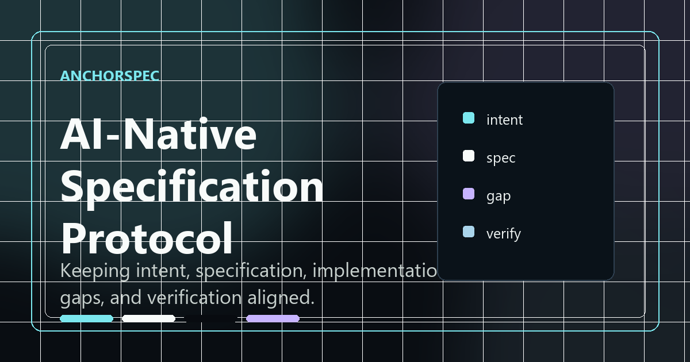
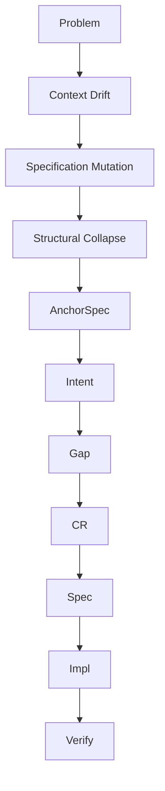

MIT License   
PreRelease v2.3   
AI-Native Development Protocol   



# AnchorSpec

🌐 **Official Website:** https://nia-anoma.github.io/AnchorSpec-web/

## What is AnchorSpec?

AnchorSpec is an AI-native development protocol that separates   
Intent, Specification, Implementation, and Verification into independent responsibilities.   

Instead of asking AI to remember everything correctly,   
AnchorSpec keeps structural decisions observable, reviewable, and reproducible.   

### AI-Native Development Protocol

[日本語版 / Japanese README](./README_JA.md)

**Author:** Nia Anoma
**Co-Author (AI)**: Marie(ChatGPT)、Yuri(Claude)、Rize(Gemini)、Roze(Grok)

Like the Pioneer Anomaly, structural drift is often small, silent, and difficult to notice — until the trajectory itself changes.

> AI can generate code.
> But it still cannot own structural responsibility.

AnchorSpec is an **AI-Native Development Protocol** designed for long-running software development with LLMs.

It focuses on controlling structural failure modes that emerge during AI-assisted development, such as:

* Context Drift
* Semantic Load
* Silent Spec Mutation
* Structural Collapse

Instead of relying on AI to “stay correct,”
AnchorSpec attempts to reduce these failures through **responsibility separation and structural control**.

---

## Why AnchorSpec Exists

LLMs are powerful.

But during long-running development sessions, something begins to happen:

* Specifications silently mutate
* Earlier decisions disappear
* “Currently working code” starts overriding architecture
* AI begins reinterpreting structure itself
* Reproducibility collapses over time

These are not simple operational mistakes.

They are structural properties of LLM-based development.

AnchorSpec was designed to address this problem not through prompting tricks, but through protocol-level separation.

> AI is intelligent.
> Context is fragile.
> AnchorSpec exists to fight that structurally.

---

## Core Philosophy

AnchorSpec separates:

* Intent
* Specification
* Implementation
* Differences
* Verification

because mixing them together eventually causes AI systems to optimize for “local coherence” instead of structural consistency.

AnchorSpec is designed to resist:

> “plausible structural collapse.”

---

## Core Structure

```text id="l4k0zw"
Intent → Gap → CR → Spec → Impl → Verify
```

The goal of AnchorSpec is not simply to make AI generate correct code.

The goal is:

> to keep divergence observable.

---

## Key Concepts

### Intent

Defines goals, constraints, non-goals, and reasoning.

### Gap

The entry point for all undefined states, contradictions, uncertainties, and ideas.

### CR (Change Request)

Transforms raw differences into structured modifications that can affect Spec.

### Spec

The Source of Truth.

Not a discussion log.
Only currently valid structure should exist here.

### Impl

Implementation derived from Spec.

### Verify

A verification-only layer.

Verify does not fix.
It only detects and reports.

### Current

Experimental sandbox state.

Useful, but intentionally untrusted.

### Freeze / Thaw

Freeze is not version locking.

It creates stable structural reference points that future work can safely return to.

---

## Concepts Introduced by AnchorSpec

### Semantic Load

The accumulated density of meaning inside a context.

Not token count, but dependency complexity.

### Context Drift

The gradual collapse of semantic priority during long-running interactions.

### Structural Lie

Not factual hallucination.

A Structural Lie is a structural reinterpretation generated by AI
to maintain local consistency under semantic pressure.

Instead of producing obviously incorrect information,
the AI produces structurally plausible but semantically divergent output.

### Discrete Drift

Hidden divergence caused by changes occurring outside the current context.

---

## Parallel Model (Strand Model)

AnchorSpec v2.3 introduces the Strand Model for parallel development flows.

### Strand

An independent development line.

### Splice

Constructs references between multiple Strands.

AnchorSpec intentionally avoids traditional merge-oriented thinking.

### Select

Chooses which Strand becomes active.

### Register

Promotes a ProtoStrand into a formal Strand.

---

## Important Rules

* Never directly edit Spec
* All changes must pass through Gap → CR
* Verify never performs fixes
* Current must never be directly adopted
* Freeze is not compression
* Structural responsibility belongs to humans

> AI assists implementation.
> Humans retain structural ownership.

---

## Workflow



---

## Anti-Pattern

### Delegating structure entirely to AI

This is the primary failure mode AnchorSpec attempts to prevent.

LLMs are extremely capable, but over long contexts they begin generating structurally plausible reinterpretations.

The result is:

* silent specification mutation
* disappearing rationale
* architectural instability
* irreversible drift

AnchorSpec was designed backwards from this failure.

---

## Documents

| Document        | Role                                         |
| --------------- | -------------------------------------------- |
| AnchorSpec.md   | Core concepts / definitions                  |
| OPERATION.md    | Operational model *(planned)*                |
| REFERENCE.md    | Anti-patterns / judgment support *(planned)* |
| INSTALLATION.md | AI installation guide *(planned)*            |
| EVALUATION.md   | AI evaluation protocol *(planned)*           |

---

## Current Status

Current release: **PreRelease v2.3**

This prerelease temporarily splits the original AnchorSpec document into multiple files in preparation for future responsibility separation.

Full restructuring is still in progress.

---

## Repository Structure

```text id="1a0v8n"
/
├─ README.md
├─ README_JA.md
├─ AnchorSpec.md
├─ OPERATION.md
├─ assets/
└─ old/
```

Older releases are archived under `old/`.

---

## Philosophy

> AI accelerates implementation.
> Humans must not lose structure.

---

## Community

🌐 Official Website  
https://nia-anoma.github.io/AnchorSpec-web/

💬 GitHub Discussions  
Questions, ideas, and general discussions are welcome.

🐞 GitHub Issues  
Bug reports, feature requests, and documentation issues.

📧 Contact  
anchorspec.official@gmail.com

